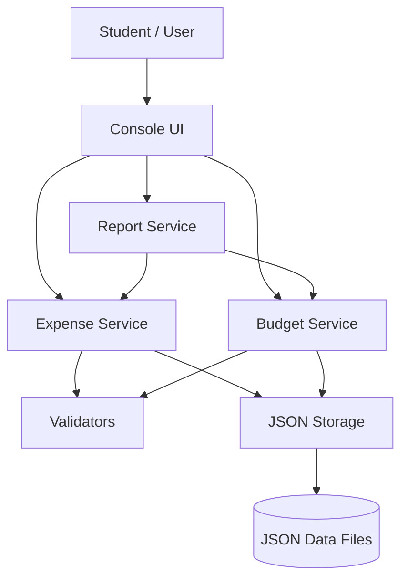
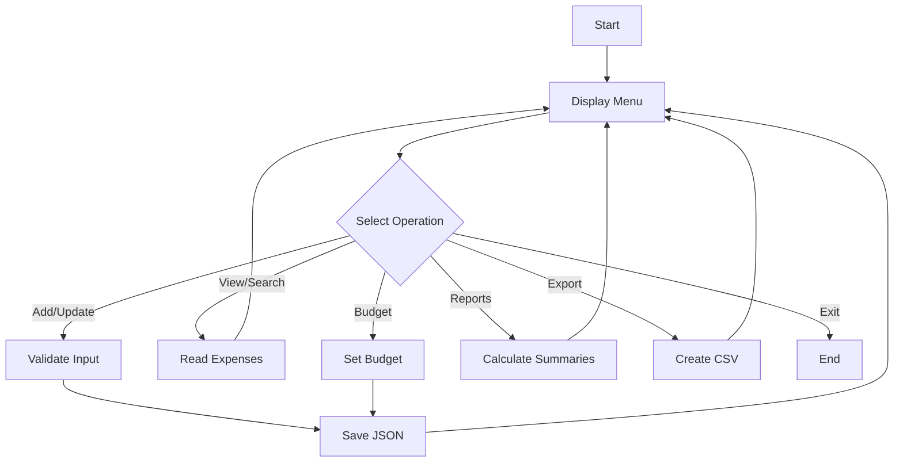
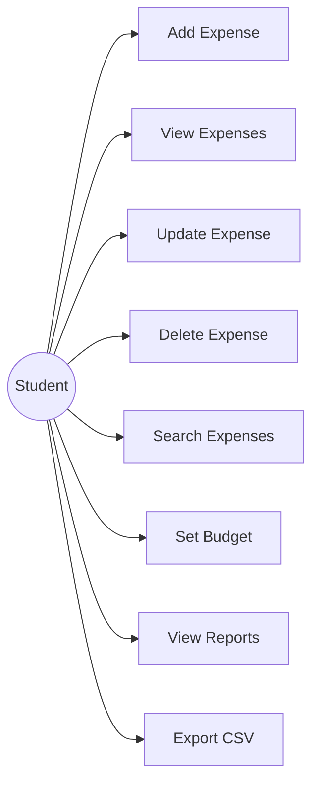
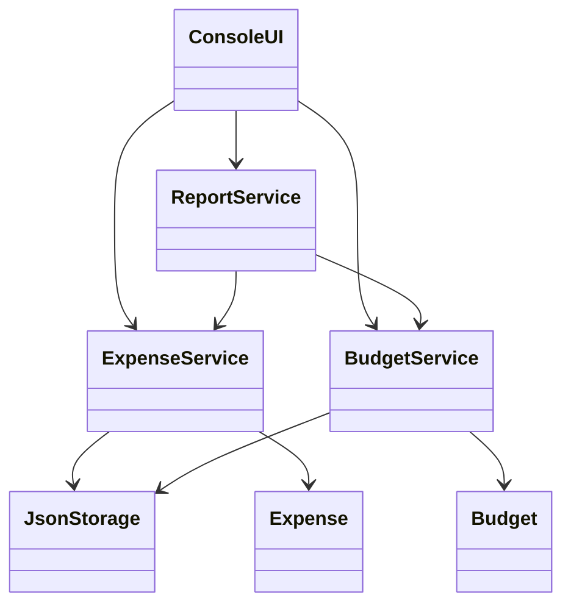
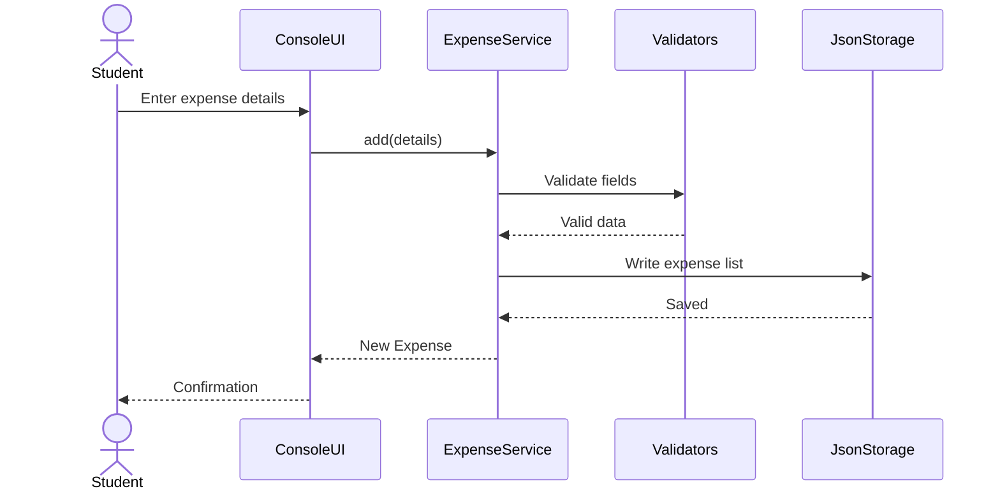

# Design & Documentation

## 1. Functional Requirements

| ID | Requirement |
|---|---|
| FR1 | Add an expense with name, amount, category, date and note. |
| FR2 | View, update and delete saved expenses. |
| FR3 | Search expenses by category or keyword. |
| FR4 | Set a spending budget for a category. |
| FR5 | Calculate total and category-wise spending. |
| FR6 | Compare category spending with budgets. |
| FR7 | Export expense records to CSV. |

## 2. Non-Functional Requirements

- **Usability:** menu-driven console interface with clear prompts.
- **Reliability:** JSON writes use a temporary file before replacement.
- **Maintainability:** responsibilities are separated into modules/classes.
- **Performance:** local JSON processing is suitable for a small student expense dataset.
- **Error handling:** invalid numeric, date and text inputs are validated.
- **Resource efficiency:** no external services or database server are required.

## 3. Architecture Diagram

## 4. Workflow Diagram

## 5. Use Case Diagram

## 6. Class / Component Diagram

## 7. Sequence Diagram — Add Expense

## 8. Storage / Schema Design

`expenses.json` records:

| Field | Type | Description |
|---|---|---|
| id | integer | Unique expense identifier |
| name | string | Expense name |
| amount | number | Expense amount |
| category | string | Expense category |
| date | string | YYYY-MM-DD date |
| note | string | Optional note |

`budgets.json` records:

| Field | Type | Description |
|---|---|---|
| category | string | Budget category |
| limit | number | Maximum planned spending |

## 9. Design Decisions

JSON was retained because the original project already used local JSON storage and the project is intended to remain simple to run without an external database. Business logic is separated from storage and user-interface code so that individual components can be tested independently.
